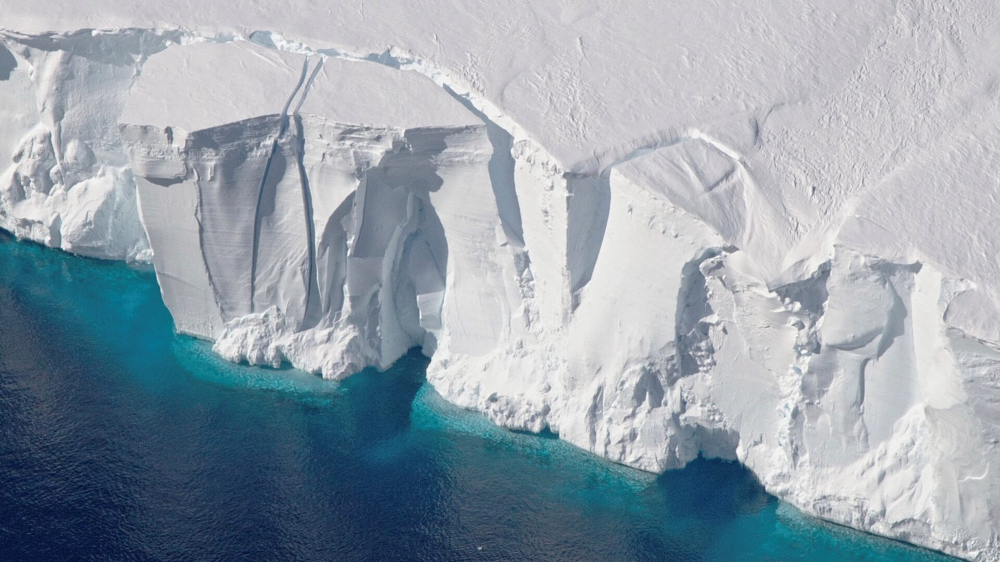
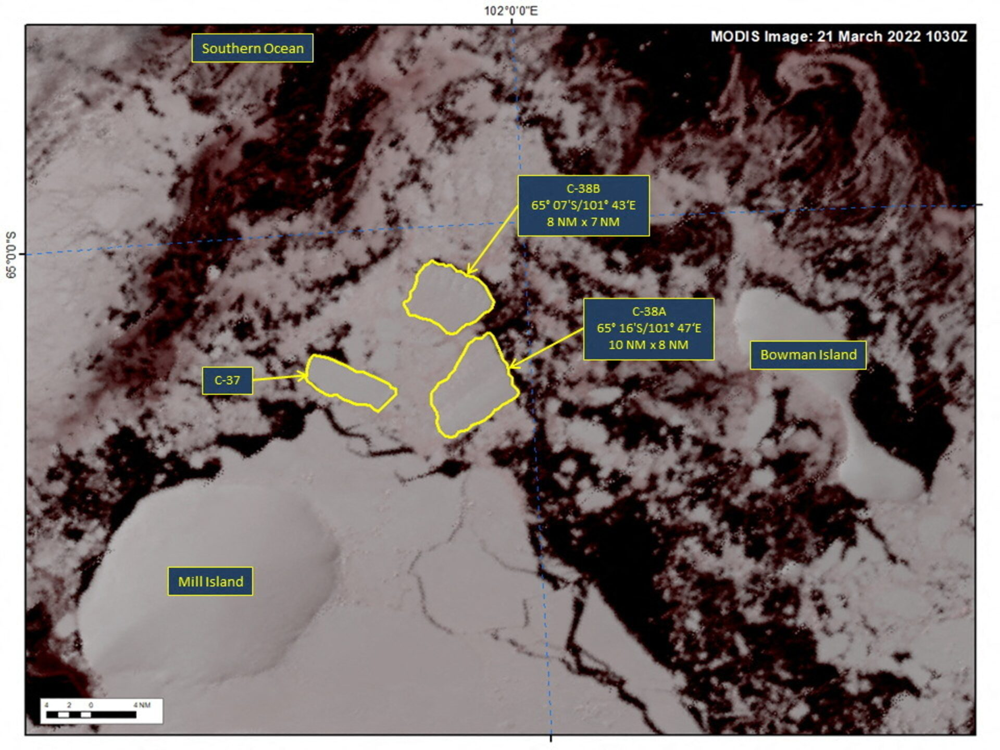

# Glacier Probe Model

An engine for analyzing and mapping long-term glacier retreat patterns using satellite imagery. This project employs a hybrid approach combining traditional machine learning with deep learning techniques to detect, segment, and track glacier boundaries over time.


<div>
    
    
</div>

(PS : The images is not related to this project.)

## Overview

A computer vision project analyzing glacier disintegration over time to support climate awareness and action. Glacier Probe Model applies image segmentation, edge detection, and temporal pattern recognition to multi-decadal satellite imagery, tracking glacier boundary changes and quantifying ice loss rates. The system combines traditional computer vision techniques with machine learning for baseline detection, then employs deep learning-based semantic segmentation to handle complex scenarios including debris-covered glaciers and shadowed regions.

## Key Capabilities

**Phase 1: ML-Based Detection**
- NDSI (Normalized Difference Snow Index) calculation from multispectral bands
- Random Forest classifier trained on spectral, texture (GLCM), and terrain features
- Automated cloud masking using QA bands
- Temporal image co-registration and atmospheric correction

**Phase 2: Deep Learning Enhancement**
- U-Net semantic segmentation for precise boundary delineation
- Transfer learning using ImageNet pre-trained encoders
- Temporal consistency enforcement across time series
- Debris-covered glacier detection using additional NIR/SWIR band combinations

**Analysis Pipeline**
- Multi-decadal change detection (1984-present)
- Automated area loss quantification and retreat rate calculation
- Statistical analysis of seasonal variations

## Dependencies

### Core Libraries
- Python 3.8+
- PyTorch 2.0+ or TensorFlow 2.12+
- Scikit-learn 1.3+
- OpenCV 4.8+
- NumPy 1.24+, Pandas 2.0+

### Geospatial Processing
- Rasterio 1.3+ (GeoTIFF handling)
- GDAL 3.6+
- Google Earth Engine Python API
- Sentinelsat (Sentinel-2 data access)
- GeoPandas 0.13+ (vector operations)
- Earthpy 0.9+

### Machine Learning
- Scikit-image 0.21+ (edge detection, texture features)
- XGBoost 2.0+
- Segmentation Models PyTorch
- timm (pre-trained encoders)

### Visualization
- Matplotlib 3.7+, Plotly 5.17+
- Folium 0.14+ (interactive maps)
- Streamlit 1.28+ (web dashboard)

## Installation

```bash
# Clone repository
git clone https://github.com/Manjushwarofficial/Glacier-Probe-Model.git
cd Glacier-Probe-Model

# Create virtual environment
python -m venv venv
source venv/bin/activate  # On Windows: venv\Scripts\activate

# Install dependencies
pip install -r requirements.txt

# Install GDAL (if not already installed)
# Ubuntu/Debian
sudo apt-get install gdal-bin libgdal-dev

# macOS
brew install gdal

# Windows: Download from https://www.gisinternals.com/

# Authenticate Google Earth Engine (for data download)
earthengine authenticate
```

## Quick Start

### Basic Glacier Detection

```python
from glacier_probe import GlacierDetector, ChangeAnalyzer

# Initialize detector
detector = GlacierDetector(
    method='random_forest',
    ndsi_threshold=0.4,
    cloud_threshold=20
)

# Load Landsat 8 scene
image = detector.load_image('LC08_L2SP_path_row_date.tif')

# Detect glacier boundaries
glacier_mask = detector.detect(image)

# Save results
detector.save_mask(glacier_mask, 'output/glacier_2023.tif')
```

### Multi-Temporal Change Analysis

```python
# Analyze retreat between two dates
analyzer = ChangeAnalyzer()

images = [
    'data/glacier_1990.tif',
    'data/glacier_2000.tif',
    'data/glacier_2010.tif',
    'data/glacier_2023.tif'
]

results = analyzer.calculate_temporal_change(images)

print(f"Total area loss: {results['area_loss_km2']:.2f} km²")
print(f"Average retreat rate: {results['retreat_rate_m_per_year']:.2f} m/year")
```

### Running the Full Pipeline

```bash
# Step 1: Download and preprocess satellite data
python scripts/download_data.py --region himalaya --start-date 1990-01-01 --end-date 2023-12-31

# Step 2: ML-based baseline detection
python scripts/ml_detection.py --input data/processed --output results/ml_baseline

# Step 3: DL refinement (requires trained model)
python scripts/dl_segmentation.py --input data/processed --checkpoint models/unet_best.pth --output results/dl_refined

# Step 4: Generate analysis report
python scripts/generate_report.py --ml-results results/ml_baseline --dl-results results/dl_refined --output reports/
```

## Project Structure

```
Glacier-Probe-Model/
├── glacier_probe/
│   ├── __init__.py
│   ├── preprocessing/
│   │   ├── atmospheric_correction.py
│   │   ├── cloud_masking.py
│   │   └── coregistration.py
│   ├── features/
│   │   ├── spectral_indices.py    # NDSI, NDWI, NDVI calculation
│   │   ├── texture_features.py     # GLCM implementation
│   │   └── terrain_features.py     # Slope, aspect from DEM
│   ├── models/
│   │   ├── random_forest.py        # RF classifier
│   │   ├── unet.py                 # U-Net architecture
│   │   └── train.py                # Training scripts
│   ├── detection/
│   │   ├── threshold_detection.py  # NDSI thresholding
│   │   ├── ml_detection.py         # ML-based detection
│   │   └── dl_detection.py         # DL-based detection
│   └── visualization/
│       ├── temporal_plots.py
│       └── interactive_maps.py
├── data/
│   ├── annotatios/
│   ├── processed/
│   ├── raw/
│   ├── reference/
│   └── README.MD
├── notebooks/
│   ├── 01_data_exploration.ipynb
│   ├── 02_ndsi_baseline.ipynb
│   ├── 03_ml_training.ipynb
│   ├── 04_dl_refinement.ipynb
│   └── 05_temporal_analysis.ipynb
├── scripts/
│   ├── download_data.py            # GEE/Sentinelsat data download
│   ├── ml_detection.py
│   ├── dl_segmentation.py
│   └── generate_report.py
├── tests/
│   ├── test_preprocessing.py
│   ├── test_features.py
│   └── test_models.py
├── configs/
│   ├── ml_config.yaml              # ML hyperparameters
│   └── dl_config.yaml              # DL training config
├── models/                         # Saved model checkpoints
├── results/                        # Detection outputs
├── reports/                        # Generated analysis reports
├── requirements.txt
├── .gitignore
├── LICENSE.md
└── README.md
```

## Methodology

### Phase 1: Machine Learning Baseline

**Preprocessing & Computer Vision Pipeline:**
- Atmospheric correction and radiometric normalization
- Cloud masking using QA band analysis
- Image co-registration for temporal alignment
- Edge detection using Canny and Sobel operators for boundary refinement

**Feature Extraction:**
- Spectral indices: NDSI, NDWI, NDVI
- Texture features: GLCM (contrast, homogeneity, energy)
- Morphological operations for noise reduction
- Terrain derivatives from DEM

**Classification:**
- Random Forest with spectral and texture features
- Post-processing: morphological opening/closing, contour analysis
- Minimum area filtering for false positive reduction

**Expected Performance:** IoU 0.82-0.88, F1 Score 0.85-0.91

### Phase 2: Deep Learning Enhancement

**Training Data & Image Segmentation:**
- 256×256 pixel patches from satellite scenes
- Use Phase 1 predictions as pseudo-labels
- Data augmentation: rotation, flipping, color transforms
- Train/val/test split: 70/15/15

**U-Net Architecture:**
- Encoder: ResNet34/ResNet50 (pre-trained)
- Loss: Binary Cross-Entropy + Dice Loss
- Optimizer: AdamW, learning rate 1e-4
- Training: 50-100 epochs with early stopping

**Computer Vision Enhancement:**
- Boundary refinement using contour detection
- Temporal consistency through median filtering
- Multi-scale feature extraction for debris-covered regions

**Expected Performance:** IoU 0.89-0.94 (clean ice), 0.72-0.82 (debris-covered)

## Performance Metrics

- Intersection over Union (IoU)
- F1 Score (Dice Coefficient)
- Pixel Accuracy
- Boundary F1 (within 30m buffer)
- Temporal Consistency Score

## Contributing

Contributions are welcome. Please:

1. Fork the repository
2. Create a feature branch (`git checkout -b feature/improved-segmentation`)
3. Commit changes with clear messages
4. Ensure tests pass (`pytest tests/`)
5. Submit a pull request

## Citation

If this project contributes to your research, please cite:

```bibtex
@software{glacier_probe_model_2025,
  author = {Manjushwar},
  title = {Glacier Probe Model: Hybrid ML-DL System for Glacier Retreat Analysis},
  year = {2025},
  url = {https://github.com/Manjushwarofficial/Glacier-Probe-Model}
}
```

## License

This project is licensed under the MIT License. See LICENSE file for details.

## Acknowledgments

- ESA Copernicus Programme for Sentinel-2 data
- USGS for Landsat Collection 2 data
- NSIDC for hosting the Randolph Glacier Inventory
- GLIMS community for glacier outline validation data

## Development Roadmap

- [x] Repository initialization and documentation
- [ ] Data download pipeline implementation (GEE + Sentinelsat)
- [ ] Phase 1: NDSI baseline and Random Forest classifier
- [ ] Validation framework with RGI cross-comparison
- [ ] Phase 2: U-Net architecture and training pipeline
- [ ] Temporal analysis module with statistical testing
- [ ] Interactive Streamlit dashboard
- [ ] REST API for on-demand glacier analysis
- [ ] Multi-region comparative study (Himalaya, Alps, Andes)
- [ ] Real-time monitoring system with alert capabilities

**Status:** This project is under active development. Phase 1 implementation is in progress. Documentation and code will be updated regularly.
