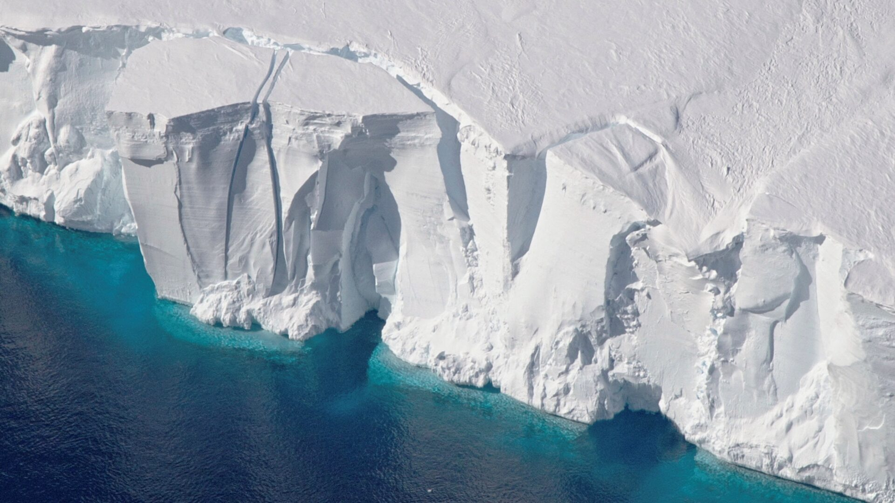

# Glacier Probe Model

An engine for analyzing and mapping long-term glacier retreat patterns using satellite imagery. This project provides a standalone application for analyzing glacier disintegration using classic computer vision and machine learning techniques.

<div>
    
    
</div>


## Overview

This project is a computer vision tool built with **PyQt6** for analyzing glacier satellite imagery. It allows users to load their own pre-trained machine learning models (`.pkl` files) to perform two primary tasks:

* **Glacier Retreat Classification:** Predicts if a glacier in an image is *Stable* or *Retreating* based on a comprehensive set of 89 extracted image features.
* **Image Segmentation:** Classifies each pixel in an image as *Ice*, *Water*, or *Other* using image features to generate a detailed segmentation map and statistics.

The application is designed to be user-friendly, allowing researchers to apply their own models to new imagery without complex scripting. It runs analysis in the background using `QThread` to keep the UI responsive.


## Key Capabilities

* **PyQt6 GUI Application**
* **Standalone desktop tool** for Windows, macOS, and Linux
* Tabbed interface for *Retreat Classification* and *Image Segmentation*
* Allows loading of custom joblib (`.pkl`) models, scalers, and feature lists
* Asynchronous model execution using `QThread`
* Interactive visualization panel using **Matplotlib**


## Glacier Retreat Classification

* Predicts if a glacier is *Stable* or *Retreating*
* Extracts 89 features (spectral, texture, edge, morphological, statistical, and gradient)
* Displays prediction results with probabilities and feature values
* Exports results as **PNG** or **CSV**


## Pixel-Level Segmentation

* Classifies each pixel as *Ice*, *Water*, or *Other*
* Uses a 9-feature extraction pipeline per pixel (RGB, local means, brightness, color ratios)
* Provides visual overlays and class statistics
* Exports visualization as **PNG** or segmentation map as **.npy**


## Dependencies

Requires **Python 3.8+** and the following libraries:

```bash
PyQt6
matplotlib
numpy
pandas
rasterio
joblib
scikit-image
scipy
Pillow
```


## Installation

```bash
# Clone repository
git clone https://github.com/Manjushwarofficial/Glacier-Probe-Model.git
cd Glacier-Probe-Model

# Create virtual environment
python -m venv venv
source venv/bin/activate  # On Windows: venv\Scripts\activate

# Install dependencies
pip install PyQt6 matplotlib numpy pandas rasterio joblib scikit-image scipy Pillow
```


## Quick Start

### 1. Prepare Your Models

Ensure you have the following pre-trained `.pkl` models:

* `glacier_retreat_model_svm_(rbf).pkl`
* `glacier_retreat_scaler.pkl`
* `glacier_retreat_features.pkl`
* `glacier_segmentation_model.pkl`
* `glacier_segmentation_scaler.pkl`

### 2. Run the Application

```bash
python main.py
```

### 3. Load Models in the GUI

* Click **Get Started** on the welcome screen
* In *Model Configuration*, use **Browse...** to select model files
* Click **Load Models**

### 4. Run Analysis

* Go to *Single Image Prediction* or *Image Segmentation* tab
* Click **Load Image** and choose `.tif`, `.jpg`, or `.png`
* Click **Predict Retreat Status** or **Run Segmentation**


## Project Structure

```
Glacier-Probe-Model/
├── glacier_probe/
│   ├── __init__.py
│   ├── preprocessing/
│   │   ├── atmospheric_correction.py
│   │   ├── cloud_masking.py
│   │   └── coregistration.py
│   ├── features/
│   │   ├── spectral_indices.py    # NDSI, NDWI, NDVI calculation
│   │   ├── texture_features.py     # GLCM implementation
│   │   └── terrain_features.py     # Slope, aspect from DEM
│   ├── models/
│   │   ├── random_forest.py        # RF classifier
│   │   ├── unet.py                 # U-Net architecture
│   │   └── train.py                # Training scripts
│   ├── detection/
│   │   ├── threshold_detection.py  # NDSI thresholding
│   │   ├── ml_detection.py         # ML-based detection
│   │   └── dl_detection.py         # DL-based detection
│   └── visualization/
│       ├── temporal_plots.py
│       └── interactive_maps.py
├── data/
│   ├── annotatios/
│   ├── processed/
│   ├── raw/
│   ├── reference/
│   └── README.MD
├── notebooks/
│   ├── 01_data_exploration.ipynb
│   ├── 02_ndsi_baseline.ipynb
│   ├── 03_ml_training_classification.ipynb
│   └── 04_ml_training_semantic_segmentation.ipynb
│   ├── 04_dl_refinement.ipynb
│   └── 05_temporal_analysis.ipynb
├── scripts/
│   ├── download_data.py            # GEE/Sentinelsat data download
│   ├── ml_detection.py
│   ├── dl_segmentation.py
│   └── generate_report.py
├── tests/
│   ├── test_preprocessing.py
│   ├── test_features.py
│   └── test_models.py
├── configs/
│   ├── ml_config.yaml              # ML hyperparameters
│   └── dl_config.yaml              # DL training config
├── models/                         # Saved model checkpoints
├── results/                        # Detection outputs
├── reports/                        # Generated analysis reports
├── requirements.txt
├── .gitignore
├── LICENSE.md
└── README.md
```


## Methodology

### Glacier Retreat Classification (89 Features)

* **Spectral Features:** Mean/std of bands, color ratios, brightness, saturation
* **Edge Features:** Sobel & Canny edge stats
* **Texture Features:** GLCM, LBP, entropy
* **Morphological Features:** Area, perimeter, eccentricity, solidity
* **Statistical Features:** Skewness, kurtosis
* **Gradient Features:** Gradient mean, std, direction

### Pixel-Level Segmentation (9 Features)

* RGB values
* Local mean RGB (7x7 window)
* Brightness
* Color ratios (B/R, G/R)


## Performance Metrics

* **Classification:** Accuracy, Precision, Recall, F1 Score
* **Segmentation:** Pixel Accuracy, IoU, Dice Coefficient


## Contributing

Contributions are welcome!

1. Fork the repository
2. Create a new branch:

   ```bash
   git checkout -b feature/new-feature
   ```
3. Commit your changes and submit a PR


## Citation

```bibtex
@software{glacier_probe_model_app_2025,
  author = {Manjushwar},
  title = {Glacier Probe Model: Application for Glacier Analysis},
  year = {2025},
  url = {https://github.com/Manjushwarofficial/Glacier-Probe-Model}
}
```


## License

Licensed under the **MIT License**. See `LICENSE.md` for details.


## Acknowledgments

* ESA Copernicus Programme for Sentinel-2 data
* USGS for Landsat Collection 2 data
* NSIDC for Randolph Glacier Inventory
* GLIMS community for glacier outline validation


## Development Roadmap

* [x] Core Application Framework (PyQt6)
* [x] Classification Pipeline (89 features)
* [x] Segmentation Pipeline (9 features)
* [x] Asynchronous Execution (QThread)
* [x] Result Visualization (Matplotlib)
* [x] Export (PNG, CSV, NPY)

**Status:** Core application with classification & segmentation is complete. Batch processing UI is present but not yet implemented.